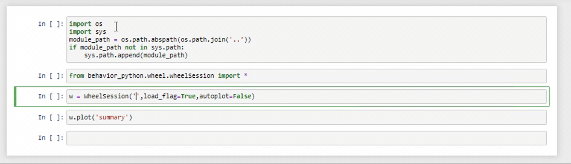

# BoninBehavior #
by S. Kaan Cetindag

Code to read,analyse and visualize behavior data. 

## Getting set up ##

### 1. Installations ###
Install [git](https://git-scm.com/downloads/) and [Anaconda](https://docs.conda.io/en/latest/miniconda.html).

### 2. Clone repository ###

Open Git Bash in the repository you want to store the code in and **right-click -> 'Git Bash here'**

*For Windows: If the 'conda' command is not found in Git Bash, that means that conda has not been added to the PATH, you can do it by right-clicking 'this PC' in 'this PC' (folder) panel, 'Advanced system settings', 'Environment Variables...', in 'User variables' select 'Path' and click 'Edit...', click 'New' and add  'C:\ProgramData\Miniconda3\Scripts' (this is the default directory for the conda.exe, select another if you choose another location during the installation).
Then you can restart Git Bash and retry.*

Clone the repository on your computer (bitbucket page, click clone and copy/paste string in Git Bash)

### 3. Environment creation ###

Open Git Bash in your stimpy folder.

In Git Bash enter:

> ```conda env create -f environment.yml```

Then activate the newly created environment using:

> ```conda activate boninbehavior```

If the above 'conda create' command failed, do the following instead:

> ```conda create -n boninbehavior```

> ```conda activate boninbehavior```

> ```conda install conda```

> ```conda install python=3 numpy scipy matplotlib-base pandas jupyterlab natsort google-api-python-client gspread google-auth oauth2client -c conda-forge -y```

> ```conda install -c anaconda google-auth-oauthlib scikit-learn -y```

### 4. Module installation

Open Git Bash or Terminal in your BoninBehavior directory, in Git Bash enter:

> ```python setup.py develop```

This will install the module, allowing you to use the code from any folder using the command ```boninbehavior```. At this point you should be all set.

For more options, enter

> ```python setup.py --help```

## How do I use BoninBehavior?

> **IMPORTANT : For now the usage is limited to bkrunch and in a Jupyter notebook**

BoninBehavior assumes locations for data in the bkrunch server, more specifically:

- Stimpy .stimlog and .riglog is in :  **J:/data/presentation/_your_experiment_name_**
- Analysed data is saved(and loaded from) : **J:/data/analysis/_your_experiment_name_**

Currently, the best way to use BoninBehavior is to open a git-bash in the BoninBehavior directory and run the code in a Jupyter notebook.




## Code Architecture
The analysis is organised to have three basic classes:
### 1. Trial
- Main parsing of the experiment data happens here. BoninBehavior uses both .stimlog and .riglog generated by [StimPy](https://bitbucket.org/activision/stimpy/src/master/) to calculate basic trial values. The main ingredient in this process is the state machine that is being used in the ExperimentController in StimPy. 
- This is mostly dependent on the behavior task that is being analysed so a custom Trial class need to be coded to parse the data according to specific needs.

### 2. Session
- This class is mostly used to get session summaries and to calculate/analyse data for a give session.
### 3. Behavior
- Aggregates multiple sessions to calculate behavior data.


### Contribution guidelines ###

* To implement a feature create a new branch *(e.g feature_VR_wheel_analysis)*

### Who do I talk to? ###

* sakir.kaan.cetindag@nerf.be

